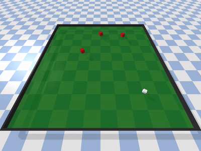
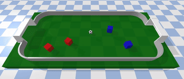

# Multi-Agent Library for Stable-Baselines3

This is a library for designing multi-agent environments compatible with [Stable-Baselines3](https://stable-baselines3.readthedocs.io/) algorithms, so each agent can be trained with the same of different algorithms such as PPO, SAC, DDPG, ...

Main features:
* Multi-agent environments can be composed of homogenous or heterogeneous agents.
* Same or different SB3 algorithms can be used simultaneouslly in the same environment, one per agent. This means that you can train one of the agents with PPO while other with SAC.
* Each agent can have different observation and action spaces as required. 
* The training process is performed by alternating the learning phases across the different agents. While one agent is training and updating its policy, the others are behaving following their *static* (previously trained) policy. The number of learning iterations and their duration in timesteps can be configured (for example, 3 agents, 100 iterations, and a total of 1_000_000 steps per agent, means that for each iteration the 3 agents will train during 10_000 steps, alternating between them). This alternance provokes in non-stationary environments (inherent to multi-agent scenarios). Results of the training are dependent on how you configure this cycle.
* Is it possible to extend the training for one of the agents, while *freezing* others to check how much the former improves under an *stationary* environment.
* `BaseMAEnv`: this is the base class to inherit in order to create multi-agent environments
* `AgentMAEnv`: this is a single-agent Gymnasium environment 'wrapper' that creates the illusion for SB3 to deal with a single agent environment. In a `BaseMAEnv` there are several instances of this class, one per agent to train.

Several demo multi-agent environments are provided for testing:
### `Predator-Prey`
A classical predator-prey environment based on Pybullet.

### `MultiAgent Soccer`
Soccer environment baed on PyBullet with configurable number of team players.

